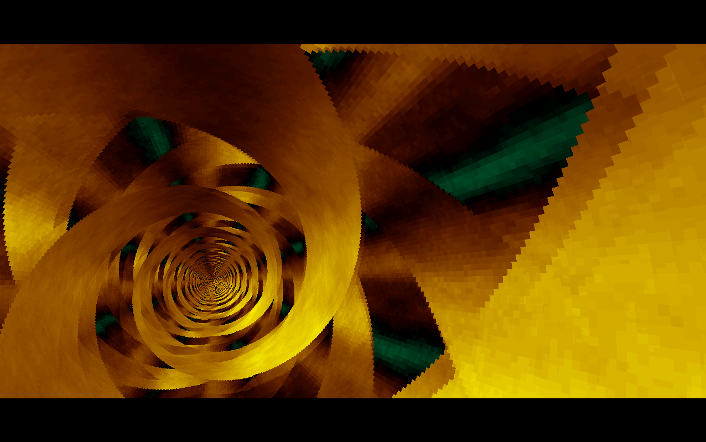
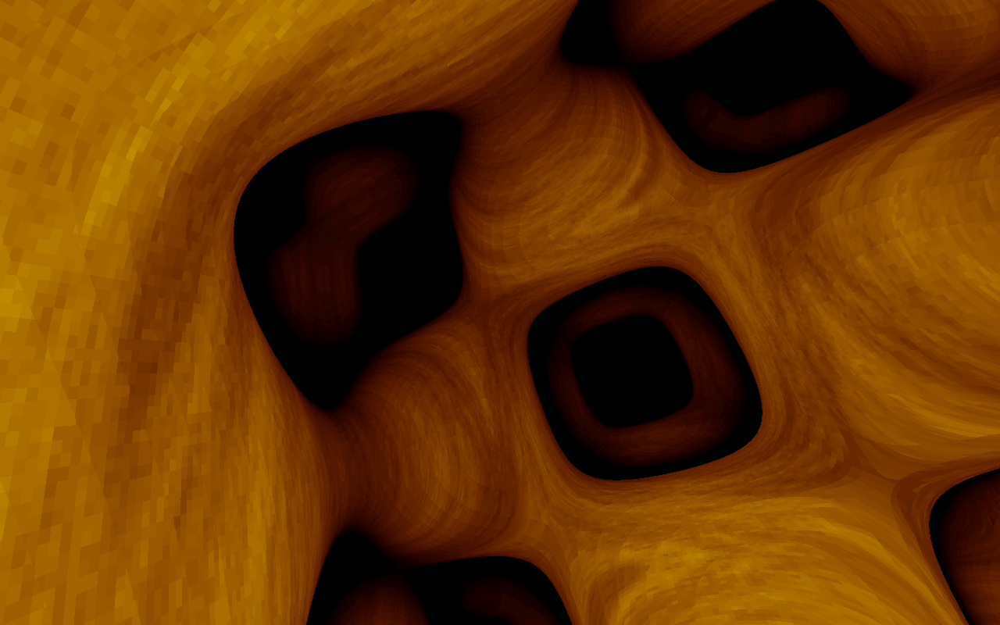
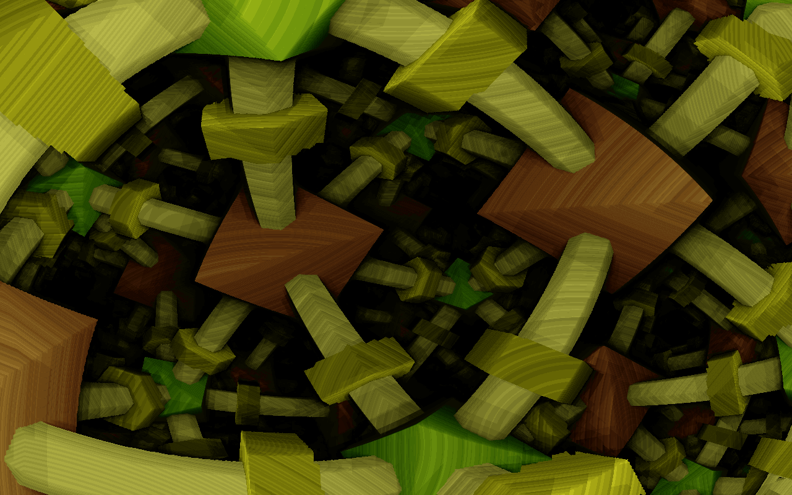

# detube

LLM-decompiled DOS demoscene intros ported to C with SDL 1.2.

Three effects from the 256-byte intro scene, reverse-engineered from x86 real-mode COM binaries into readable C.

## Effects

- **tube** - Rotating 3D tunnel with texture mapping and motion blur (original by baze)
- **lattice** - Raymarched Schwarz P-surface (triply periodic minimal surface) with sphere tracing (original 256-byte intro by baze)
- **puls** - Raymarched implicit surface lattice with octahedra, bars, and bolts using binary search (original 256-byte intro by Rrrola, Riverwash 2009)








## Building

```
make
```

Requires `libsdl1.2-dev` (or equivalent) and a C compiler with math library support.

## Programs

### Original resolution (320x200)

These are direct ports with no CLI arguments:

- `tube_sdl` - Tunnel effect
- `lattice_sdl` - Lattice effect
- `puls_sdl` - Puls effect

### Arbitrary resolution

Scaled versions that accept custom window dimensions:

- `tube_big [width height]` - Tunnel at any resolution (default 320x200)
- `lattice_big [width height]` - Lattice at any resolution (default 320x200)
- `puls_big [width height [precision]]` - Puls at any resolution with configurable raymarching precision 0-8 (default: auto from resolution)

### Multi-threaded

- `lattice_parallel [width height]` - Multi-threaded lattice renderer. Set `THREADS` env var for thread count (default 16).
- `puls_parallel [width height [precision]]` - Multi-threaded puls renderer. Set `THREADS` env var for thread count (default 16).

## Controls

All `*_big`, `lattice_parallel`, and `puls_parallel` programs support:

| Key | Action |
|-----|--------|
| ESC | Quit |
| + / = | Increase speed (1.25x) |
| - | Decrease speed (0.8x) |
| S | Save screenshot (BMP) |

Screenshots are saved as `screenshot_0001.bmp`, `screenshot_0002.bmp`, etc. in the current directory.

The `*_sdl` programs only support ESC to quit.

## Credits

- **tube**, **lattice** - Original intros by baze
- **puls** - Original 256-byte intro by Rrrola (Riverwash 2009)
